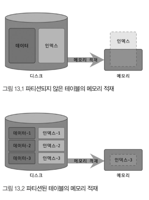

# 13. 파티션
```text
파티션 기능은 논리적인 하나의 테이블을 물리적으로 여러 개 테이블로 분리해 관리할 수 있게 해준다.
주로 대용량 테이블을 물리적인 여러 개의 소규모 테이블로 분산하는 목적으로 사용한다.
하지만 파티션은 만병통치약이 아니다. 어떤 쿼리인가에 따라 성능이 오히려 나빠지는 경우도 자주 있다.
살펴봅씨다~
```

## 13.1 개요
```text
MySQL 파티션이 적용된 테이블에서 INSERT, SELECT 등의 쿼리가 어떻게 실행되는지 이해하면,
파티션 사용 최적을 쉽게 이해할 수 있다.
```

### 13.1.1 파티션을 사용하는 이유
```text
테이블에 데이터가 많다고 무조건 파티션을 적용하는 것은 효율적이지 않다.
하나의 테이블이 너무 커서 물리적인 메모리보다 훨씬 더 크거나 데이터 특성상 주기적인 삭제 작업이 필요한 경우
파티션이 필요하다고 할 수 있다. 

Q) 테이블이 너무 크다 -> 인덱스 크기, 테이블 전체 컬럼 크기?, 로우 데이터 수? 
Q) 테이블이 너무 크다 -> 물리적인 메모리보다 훨씬 크다를 알기 위해 어떤 정보를 활용? 
```

#### 13.1.1.1 단일 INSERT와 단일 & 범위 SELECT의 빠른 처리
```text
DB 인덱스는 일반적으로 SELECT를 위한 것으로 보이지만, UPDATE, DELETE 쿼리를 위해서 필요할 때도 많다.
레코드 변경 쿼리 실행시 인덱스의 변경을 위한 부가 작업이 발생하지만, 
UPDATE, DELETE 처리를 위해 레코드 검색을 위한 인덱스는 필수적이다.

인덱스가 커질수록 SELECT는 말할 것도 없고, INSERT, UPDATE, DELETE 작업도 함께 느려지는 단점이 있다.
테이블 인덱스 크기가 MySQL의 물리적 사용 가능 메모리 공간보다 크면 영향은 더 심각해진다.

테이블의 데이터는 MySQL 물리적 사용 가능 공간보다 큰 것이 일반적이지만, 
인덱스의 워킹 셋이 실질적인 MySQL 물리적 사용 가능 공간보다 크다면 쿼리 처리가 상당히 느려진다.
```


```text
파티션 1-1 이미지는 큰 테이블을 관리할 때 파티션을 사용, 미사용 비교 이미지다.
파티션을 나눠서 워킹 셋 크기가 줄었을 때 인덱스의 워킹 셋이 물리적인 메모리르 어떻게 사용하는지를 보여준다.

큰 테이블을 파티션하지 않은 경우 인덱스도 커지고 그만큼 물리적인 메모리 공간도 많이 필요해진다.
반면 파티션 사용시 데이터와 인덱스를 조각화해서 물리적 메모리를 효율적으로 사용할 수 있게 만들어준다.

Q) 파티션 적용/미적용시 어떤 저장소에 저장하느냐에 차이? 예를 들면 전체 크기는 동일한가? 분산을 통한 효율성을 보기 위함?

ex) 테이블 데이터 10GB, 인덱스 3GB
테이블은 13GB 전체를 항상 사용하지 않는다. 이 중 일정 부분만 활발하게 사용
예를 들어 100만 건 저장 테이블이라도, 그 중 최신 20 ~ 30% 게시물만 활발하게 조회
이렇듯 활발하게 사용되는 데이터를 워킹 셋(Working Set)이라고 표현한다.
따라서 파티션을 통해 활발하게 사용되는 데이터를 나뉘어 파티션 할 수 있따면 상당한 효과적인 성능을 개선 가능하다. 
```

#### 13.1.1.2 데이터의 물리적인 저장소를 분리
```text
데이터 파일이나 인덱스 파일이 파일 시스템에 차지하는 공간이 크다면 백업, 관리 작업이 어려워진다.
MySQL 서버는 테이블의 데이터나 인덱스를 파일 단위로 관리하기 때문에 더 치명적인 문제가 된다.
이런 문제를 파티션을 통해 파일 크기 조절하고 파티션별 파일들이 저장될 위치나 디스크 구분해서 지정해 해결하는 것도 가능하다.

MySQL에서는 테이블의 파티션 단위 인덱스 생성 또는 파티션별 다른 인덱스를 가지는 형태를 지원하지 않는다.
Q) 다른 RDBMS는 지원한다는 얘기인가?
```

#### 13.1.13 이력 데이터의 효율적인 관리
```text
대부분의 애플리케이션은 로그 데이터를 쌓는다.
이는 단기간 대량 누적됨과 동시에 일정 기간이 지나면 대부분 쓸모없는 데이터가 된다.
따라서 로그 데이터는 일정 시간이 지나면 별도 아카이빙 또는 백업 후 데이터는 삭제하는 것이 일반적이다.

로그 테이블에서 불필요 데이터를 백업하거나 삭제하는 작업을 파티션으로 관리한다면,
불필요 데이터 삭제 작업은 단순히 파티션을 삭제하고 추가하는 방식으로 빠르게 해결할 수 있다. 
ex) 연도별로 파티션을 생성하고 특정 연도를 삭제하고 추가해서 관리

대량의 데이터가 저장된 로그 테이블을 기간 단위로 삭제해버리면, MySQL 전체적으로 미치는 부하 뿐 아니라,
로그 테이블 자체 동시성에도 영향을 미칠 수 있다.
파티션을 이용해도 발생할 순 있지만, 이러한 이슈 발생 가능성을 줄일 수 있다.
```

### 13.1.2 MySQL 파티션의 내부처리
```sql
-- 파티션 적용 테이블의 INSERT, UPDATE, SELECT 처리를 살펴보자.
-- reg_date를 파티션 키로 이용한다. 
CREATE TABLE tb_article (
    id INT NOT NULL,
    reg_date DATETIME NOT NULL,
    ...,
    PRIMARY KEY (id, reg_date)                        
) PARTITION BY RANGE ( YEAR(reg_date) ) (
    PARTITION p2009 VALUES LESS THAN (2010),
    PARTITION p2010 VALUES LESS THAN (2011),
    PARTITION p2011 VALUES LESS THAN (2012),
    PARTITION p9999 VALUES LESS THAN MAXVALUE
);
```
#### 13.1.2.1 파티션 테이블의 레코드 INSERT
```text
INSERT 쿼리 실행시 파티션 키 reg_date 칼럼의 값을 이용해 파티션 표현식을 평가하고, 
그 결과를 통해 레코드가 저장될 적절한 파티션을 결정한다.
파티션 결정 후 나머지 과정은 일반 테이블과 동일하게 처리된다. 
```

#### 13.1.2.2 파티션 테이블의 UPDATE
```text
UPDATE 쿼리 실행시 변경 대상 레코드가 어느 파티션에 저장돼 있는지 찾는다.
WHERE 조건 절에 파티션 키 칼럼이 존재한다면 레코드 저장 파티션에서 빠르게 레코드 검색 가능하다.
명시되지 않았다면, MySQL서버에서는 모든 파티션을 검색해야 한다. 
UPDATE 절차는 어떤 칼럼을 변경하느냐에 따라 큰 차이가 생긴다.
- 파티션 키 외에 칼럼만 변경시 일반 테이블과 마찬가지로 칼럼 변경
- 파티션 키 칼럼 변경시 기존 레코드가 저장된 파티션에서 해당 코드 삭제 후 파티션 키 칼럼의 표현식 평가 후 새 파티션을 결정하고 새 레코드 저장한다.
```

##### 13.1.2.3 파티션 테이블의 검색
```text
파티션 테이블 검색시 성능에 크게 영향을 미치는 조건
1. WHERE 절 조건으로 검색해야 할 파티션을 선택할 수 있는가?
2. WHERE 절 조건이 인덱스를 효율적으로 사용(인덱스 레인지 스캔)할 수 있는가? (일반 테이블 검색 성능에도 동일 성능 영향)

위에 조건 1,2가 각각 or 조건으로 true인지에 따라 달라진다. 당연히 둘 다 true인 경우가 제일 베스트다.
이 순으로 좋다. (true, true) - (false, true) - (true, false) - (false, false)
우선 순위 3,4는 피하는 것이 좋고 2도 파티샌 겨새구 많을 때는 부하가 높아지고 처리 시간이 많아질 수 있으므로 주의하자. 
```

#### 13.1.2.4 파티션 테이블의 인덱스 스캔과 정렬
```text
MySQL 파티션 테이블 인덱스는 전부 로컬 인덱스에 해당한다. 
즉 모든 인덱스는 파티션 단위로 생성되고, 테이블 전체 단위의 통합된 인덱스는 지원하지 않는다.
Q) 13.1.1.2에서 "MySQL에서는 테이블의 파티션 단위 인덱스 생성 또는 파티션별 다른 인덱스를 가지는 형태를 지원하지 않는다."라고 되어 있는데?

파티션 테이블에서는 id로 정렬되어 있지 않다. 
MySQL은 여러 파티션들이 각각 조건에 일치하는 레코드를 정렬 후 순서대로 읽으면서 우선순위 큐에 임시로 저장하고,
필요한 순서(인덱스 정렬 순서)대로 데이터를 가져온다. (파티션 데이터가 이미 정렬돼 있는 상태라 가능한 방법) 
결론적으로 파티션 테이블 인덱스 스캔을 통해 읽는 레코드는 별도 정렬 작업을 수행하지 않는다.
하지만 일반 테이블처럼 바로 반환하는 것이 아니라, 우선순위 큐 처리가 한 번 필요하다.
```

#### 13.1.2.5 파티션 프루닝
```text
옵티마이저에 의해 3개 파티션 중 2개만 읽어도 된다고 판단되면 불필요한 파티션에는 접근하지 않는다.
필요 파티션만 골라 실행 계획에 참여시키는 것을 파티션 프루닝이라고 한다. 
```
```sql
-- 실행 계획을 통해 어떤 파티션에 접근했는지 알 수 있다. 
-- 실행 계획 partitions 칼럼의 값이 파티션 키로 되어있다.
EXPLAIN SELECT * FROM test WHERE reg_date > '2099-09-03' and reg_date < '2100-09-03'; 
```

## 13.2 주의사항
```text
5.1 부터 도입되어 8.0까지 많은 발전을 했지만, 아직 많은 제약이 있다.
대부분은 파티션의 태생적 한계라서 향후에도 고쳐질지는 의문이다.
```

### 13.2.1 파티션의 제약 사항
```sql
-- 파티션 테이블 생성
CREATE TABLE tb_article (
    article_id INT NOT NULL AUTO_INCREMENT,
    reg_date DATETIME NOT NULL
    -- ...
    PRIMARY KEY(article_id, reg_date)
) PARTITION BY RANGE ( YEAR(reg_date) ) (
    PARTITION p2009 VALUES LESS THAN (2010), 
    PARTITION p2010 VALUES LESS THAN (2011), 
    PARTITION p2011 VALUES LESS THAN (2012), 
    PARTITION p9999 VALUES LESS THAN MAXVALUE 
);
```

```text
파티션의 제약사항을 이해하기 위해서는 관련 용어를 알고 있어야 한다.
- PARTITION BY RANGE 절은 레인지 파티션을 사용한다는 것이다.
- 파티션 컬럼은 reg_date
- 파티션 표현식은 YEAR(reg_date)로 사용됐다.

즉 테이블에서 reg_date 칼럼에서 YEAR() 내장 함수를 이용해 연도만 추출하고, 그 연도를 이용해 테이블을 연도 범위별로 파티션하고 있다.

그렇다면 제약사항은 뭘까? 자세한건 P.272 참고
1. 일부 내장 함수는 파티션 생성은 가능하지만, 파티션 프루닝을 지원하지 않을 수 있다.
2. PK 포함 모든 유니크 인덱스를 파티션 키 칼럼을 포함해야 한다. 
3. 동일 테이블의 파티션들은 동일 스토리지 엔진만 갖는다.
4. 최대 8192개 파티션 가질 수 있다.
Q) (PK a, b) pk 지정은 무조건 두개 이상?
Q) (인덱스 a, b, c) - 무조건 파티션 칼럼 키 포함 

위에 파티션 테이블 생성 예제를 보면 article_id만 PK 선정을 해도 좋지만, article_id, reg_date로 PK를 지정했다.
이는 파티션 키로 사용되는 칼럼은 반드시 PK 일부로 참여해야 한다는 제약 사항 때문이다.
```

### 13.2.2 파티션 사용시 주의사항
```text
파티션의 목적은 작업의 범위를 좁히는 것인데,
유니크 인덱스는 중복 레크드에 대한 체크 작업때문에 범위가 좁혀지지 않는다.

파티션도 테이블처럼 별도 파일로 관리되는데, MySQL 서버가 조작 가능한 파일 개수와 연관된 제약이 있다. 
```

#### 13.2.2.1 파티션과 유니크 키(프라이머리 키 포함)
```sql
-- 1-1 잘못된 파티션
CREATE TABLE tb_partition (
    fd1 INT NOT NULL,
    fd2 INT NOT NULL,
    fd3 INT NOT NULL,
    UNIQUE KEY (fd1, fd2)
) PARTITION BY HASH (fd3)
  PARTITIONS 4;
-- 1-2 정상 파티션
CREATE TABLE tb_partition (
    fd1 INT NOT NULL,
    fd2 INT NOT NULL,
    fd3 INT NOT NULL,
    UNIQUE KEY (fd1, fd2, fd3)
) PARTITION BY HASH (fd1)
  PARTITIONS 4;


-- 2-1 잘못된 파티션
CREATE TABLE tb_partition (
    fd1 INT NOT NULL,
    fd2 INT NOT NULL,
    fd3 INT NOT NULL,
    UNIQUE KEY (fd1, fd2)
) PARTITION BY HASH (fd1 + fd2)
  PARTITIONS 4;
-- 2-2 잘못된 파티션
CREATE TABLE tb_partition (
    fd1 INT NOT NULL,
    fd2 INT NOT NULL,
    fd3 INT NOT NULL,
    UNIQUE KEY (fd1),
    UNIQUE KEY (fd2)
) PARTITION BY HASH (fd1 + fd2)
  PARTITIONS 4;


-- 3-1 잘못된 파티션
CREATE TABLE tb_partition (
    fd1 INT NOT NULL,
    fd2 INT NOT NULL,
    fd3 INT NOT NULL,
    PRIMARY KEY (fd1),
    UNIQUE KEY (fd2, fd3)
) PARTITION BY HASH (fd1 + fd2)
  PARTITIONS 4;
-- 3-2 정상 파티션
CREATE TABLE tb_partition (
    fd1 INT NOT NULL,
    fd2 INT NOT NULL,
    fd3 INT NOT NULL,
    UNIQUE KEY (fd1, fd2, fd3),
    UNIQUE KEY (fd3)
) PARTITION BY HASH (fd3)
  PARTITIONS 4;
```

```text
유니크 키에 파티션 키가 제대로 설정됐는지 체크하려면, 
유니크 키에 값이 있을 때, 해당 레코드가 어느 파티션에 저장돼 있는지 계산 할 수 있어야 한다.
```

#### 13.2.2.2 파티션과 open_files_limit 시스템 변수 설정

## 13.3 MySQL 파티션의 종류
```text
다른 DBMS와 마찬가지로 4가지 기본 파티션 기법 제공
1. 레인지 파티션
2. 리스트 파티션
3. 해시 파티션
4. 키 파티션
```

### 13.3.1 레인지 파티션
```text
파티션 키의 연속된 범위로 파티션 정의, 가장 일반적인 사용 방법 중 하나다.
```

#### 13.3.1.1 레인지 파티션의 용도
```text
1. 날짜 기반 데이터로 누적되고 연도, 월, 일 단위 분석 및 삭제가 필요할 때
2. 범위 기반 데이터를 여러 파티션에 균등하게 나눌 수 있을 때
3. 파티션 키 위주 검색 자주 실행될 때
4. 큰 테이블 -> 작은 크기 파티션 분리할 때 장점(1) 
5. 필요 파티션 접근 (쓰기 & 읽기) 장점(2)

장점 두 가지는 모두 취하기 어렵지만, 장점(1)에 취중해서 오히려 성능이 떨어지는 경우도 있다. 
이력은 저장하는 테이블은 두 가지 장점을 모두 어렵지 않게 취할 수 있다. 

다른 파티션은 무시하더라도 최소 레인지 파티션의 정확한 사용 방법은 익혀두자. 
```

#### 13.3.1.2 레인지 파티션 테이블 생성
```sql
CREATE TABLE employees (
    id INT NOT NULL,
    first_name VARCHAR(30),
    last_name VARCHAR(30),
    hired DATE NOT NULL DEFAULT '1970-01-01'
) PARTITION BY RANGE ( YEAR(hired) ) (
    PARTITION p0 VALUES LESS THAN (1991),
    PARTITION p1 VALUES LESS THAN (1996),
    PARTITION p2 VALUES LESS THAN (2001),
    PARTITION p3 VALUES LESS THAN MAXVALUE 
);
```
```text
1. PARTITION BY RANGE 키워드로 레인지 파티션 정의
2. PARTITION BY RANGE 뒤에 내장 함수 YEAR()를 이용해 파티션 키 명시, 입사 일자 연도만 파티션 키로 사용
3. VALUES LESS THAN으로 명시된 값보다 작은 값만 해당 파티션에 저장하도록 설정 (명시 값은 해당 파티션에 포함 X, 1991, 1996, 2001)
4. 명시되지 않은 값은 VALUES LESS THAN MAXVALUE 파티션에 저장 (선택사항이므로 지정 안 해도 된다.) - 미지정시 예외 값은 에러 발생
5. 별도 지정하지 않을시 InnoDB 테이블로 생성

p0: 1990년 이하 레코드들
p1: 1991년 ~ 1995년 이하 레코드들
p2: 1996년 ~ 2000년 이하 레코드들
p3: 2001년 이후 레코드들
```

#### 13.3.1.3 레인지 파티션의 분리와 병합

##### 13.3.1.3.1 단순 파티션의 추가

##### 13.3.1.3.2 파티션 삭제

##### 13.3.1.3.3 기존 파티션의 분리

##### 13.3.1.3.4 기존 파티션의 병합

### 13.3.2 리스트 파티션
```text
레인지 파티션과 많은 부분이 흡사하게 동작한다.
차이점은 레인지는 파티션 키 값의 범위로 파티션 구성, 리스트는 키 값 하나하나를 리스트로 나열

리스트 파티션은 MAXVALUE 파티션 정의 불가
```

#### 13.3.2.1 리스트 파티션의 용도
```text
1. 파티션 키 값이 고정적일 때
2. 키 값이 연속되지 않고 정렬 순서와 관계없이 파티션을 해야 할 때
3. 파티션 키 값을 기준으로 레코드 건수 균일, 검색 조건으로 파티션 키가 자주 사용될 때
```

#### 13.3.2.2 리스트 파티션 테이블 생성
```sql
CREATE TABLE product (
    id INT NOT NULL,
    name VARCHAR(30),
    category_id INT NOT NULL
) PARTITION BY LIST ( category_id ) (
    PARTITION p_appliance VALUES IN(3),
    PARTITION p_computer VALUES IN(1, 9),
    PARTITION p_sports VALUES IN(2, 6, 7),
    PARTITION p_etc VALUES IN(4, 5, 8, NULL)
);
```
```text
1. PARTITION BY LIST 키워드로 리스트 파티션 정의
2. PARTITION BY LIST 뒤에 파티션 키 정의
3. VALUES IN (...)을 이용해 파티션 별 저장할 파티션 키 값 목록 나열
4. 파티션 키 값 중 NULL 사용 가능
```

#### 13.3.2.4 리스트 파티션 주의사항
```text
제약사항
1. MAXVALUE 정의 불가
2. NULL 파티션 별도 생성 가능
```

### 13.3.3 해시 파티션

#### 13.3.3.1 해시 파티션의 용도

#### 13.3.3.2 해시 파티션 테이블 생성

#### 13.3.3.3 해시 파티션의 분리와 병합

##### 13.3.3.3.1 해시 파티션 추가

##### 13.3.3.3.2 해시 파티션 삭제

##### 13.3.3.3.3 해시 파티션 분할

##### 13.3.3.3.4 해시 파티션 병합

##### 13.3.3.3.5 해시 파티션 주의사항

### 13.3.4 키파티션

#### 13.3.4.1 키 파티션의 생성

#### 13.3.4.2 키 파티션의 주의사항 및 특이사항

### 13.3.5 리니어 해시 파티션/리니어 키 파티션

### 13.3.5.1 리니어 해시 파티션/리니어 키 파티션의 추가 및 통합

### 13.3.5.1.1 리니어 해시 파티션/리니어 키 파티션의 추가

### 13.3.5.1.2 리니어 해시 파티션/리니어 키 파티션의 통합

### 13.3.5.1.3 리니어 해시 파티션/리니어 키 파티션과 관련된 주의사항

### 13.3.6 파티션 테이블의 쿼리 성능
```text
쿼리 실행시 테이블의 모든 파티션을 읽는지 일부 파티션만 읽는지에 따라 성능에 큰 영향을 미친다.
쿼리 실행 계획 수립시 불필요 파티션을 걸러내는 과정을 파티션 프루닝이라고 하는데, 
쿼리 성능은 테이블에서 얼마나 많은 파티션 프루닝을 할 수 있는지가 관건이다.

따라서 실행 계획을 통해 옵티마이저가 어떤 파티션을 제외하고 접근하는지 확인을 해야 한다!!!

파티션을 사용하고자 할 때는 파티션 프로닝이 얼마나 도움이 될 지 예측하고 적용해보자.
그리고 레인지 파티션 외에 파티션 방법을 적용할 때는 파티션 프루닝에 대한 고민과 테스트를 자세하게 해보고 적용 할 것을 권장한다.
```


