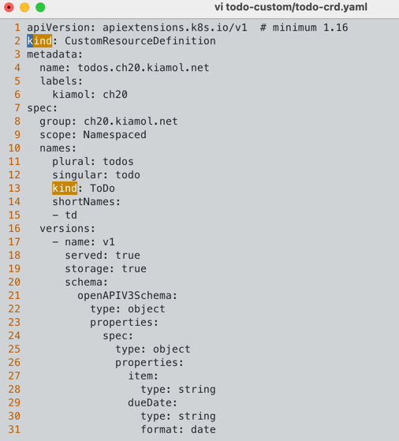
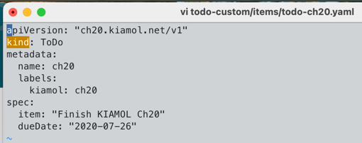
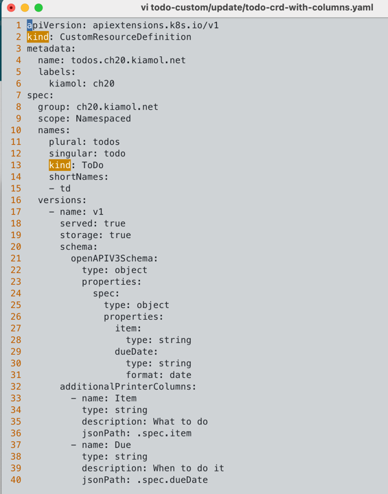
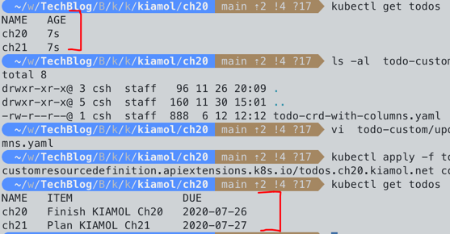
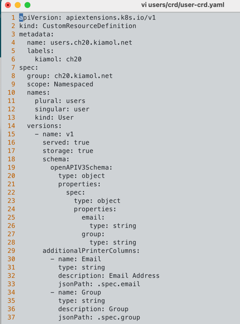
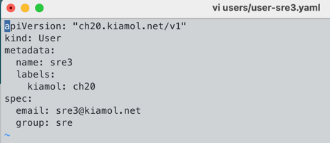
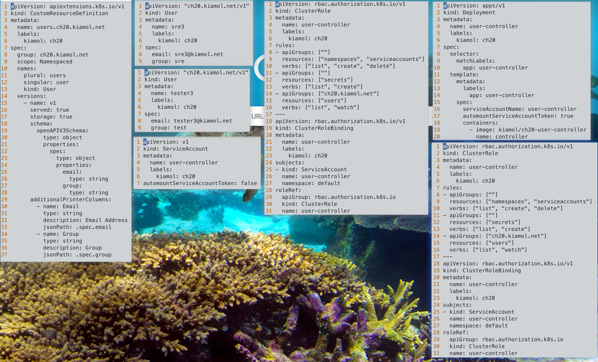

# 목차
- 4파트 고급 쿠버네티스 사용법
  - 20.1 사용자 정의 리소스를 이용한 쿠버네티스 확장하기
  - 20.2 사용자 정의 컨트롤러를 이용한 워크플로 트리거
  - 20.3 오퍼레이터를 이용한 서드파티 컴포넌트 관리하기
  - 20.4 오퍼레이션 직접 작성하기
  - 20.5 쿠버네티스의 기능 확장이 필요한 시점은 언제일까

---

# 서론
사용자 정의 리소스: K8s API를 확장해 앱 도메인에 특화된 리소스 타입 정의 후 관리해주는 기능  
K8s에서 기본적으로 여러 표준 리소스를 제공한다. (pod, service, deployment, ...)  
표준 리소스로만 앱의 모든 요구사항을 충족할 수 없다. -> 사용자 정의 리소스 사용  
즉 사용자 정의 컨트롤러를 정의하여 리소스를 다룰 수 있다.  
  
K8s의 심장은 Rest API다.  
파드 생성 API -> DB에 파드 저장 -> 컨트롤러는 파드 존재 통보 받음 -> 실행될 노드 탐색  
보통 이러한 패턴으로 리소스를 다룬다.  

- 왜 사용자 정의 리소스를 사용할까?
  - K8s API 확장
    - 도메인 특화 리소스: 앱 또는 서비스 특화 리소스를 생성해 관리 일관성 유지 가능
    - 통합 관리: K8s 기존 도구(kubectl, API 서버)를 사용해 사용자 정의 리소스 관리 가능
  - 선언적 관리
    - 상태 관리: 원하는 상태 선언, K8s를 통해 실제 상태 유지
    - 자동화: 컨트롤러를 통해 사용자 정릐 리소스 상태 자동으로 관리 및 조정 가능
  - 커스텀 컨트롤러와 오퍼레이터
    - 오퍼레이션 패턴: 사용자 정의 리소스 + 컨트롤러를 통해 복잡한 앱 배포 및 관리 자동화 가능
    - 자동화된 운영 지식: 오퍼레이터를 통해 일관되고 신뢰성 있는 운영 제공
  
# 20.1 사용자 정의 리소스를 이용한 쿠버네티스 확장하기
- CRD 역할
  - 새로운 리소스 이름, 스키마, 유효성 검사, 규칙 등 정의

CustomResourceDefinition 리소스를 추가해 확장한다.  
- 실습
  - 사용자 정의 리소스의 CRD 배치
  - cd ch20
  - kubectl apply -f todo-custom/
  - kubectl get crd -l kiamol=ch20
  - kubectl apply -f todo-custom/items/
  - kubectl get todos

    
CRD를 통해 유효성 검사, 하위 리소스, 다중 버전 등 리소스 관련 로직 추가 가능  
자세히 X, 객체 정의를 관리 할 수 있는 성숙도 높은 기능이다.  
또 다른 CRD 사용 목적은 사용자 경험 단순화다.  
- 실습
  - CRD를 활용해 더 쓸모 있는 리소스 만들기
  - kubectl apply -f todo-custom/update/
  - kubectl get todos
  - kubectl delete todo ch21
  - kubectl describe todo ch20
  

- 실습
  - Todo 리소스 제거 
  - kubectl get crds
  - kubectl delete crd todos.ch20.kiamol.net
  - kubectl get todos
  
crd 제거시 이 정의를 통해 생성한 리소스 모두 삭제된다.  
  
# 20.2 사용자 정의 컨트롤러를 이용한 워크플로 트리거
사용자 정의 리소스 "사용자"를 만들어 사용자 추가 & 삭제 플로우를 만들어보자.  
사용자 리소스를 서비스 계정 인증 수단으로 세부 사항 추상화한다.  
파드 형태로 동작해, 컨트롤러가 "사용자" 리소스 생성을 발견한다.  
  
- 컨트롤러
  - 역할: K8s 컨트롤러는 리소스 현재 상태와 원하는 상태를 비교해 필요 작업 수행하여 일치시킨다.
  - 사용자 정의 컨트롤러: 해당 리소스 상태 관리 가능
  - 주요 기능
    - 리소스 감시: 사용자 정의 리소스 변경 사항 감시
    - 조정 루프: 현재 상태와 원하는 상태 비교해 필요 작업 수행
    - 상태 업데이트: 작업 결과를 리소스 상태에 반영

- 실습
  - CRD 먼저 배치 후 리소스 정의 배치 (CRD 등록이 몇 초 걸린다.)
  - kubectl apply -f users/crd/
  - kubectl apply -f users/
  - kubectl get users
  

- 실습
  - 사용자 정의 컨트롤러 배치 후 사용자 리소스 추가시 add-user 워크플로 실행되는지 체크
  - kubectl apply -f user-controller/
  - kubectl wait --for=condition=ContainersReady pod -l app=user-controller
  - kubectl logs -l app=user-controller
  - kubectl get secret tester3-token -n kiamol-ch20-authn-test -o jsonpath='{.data.token}' | base64 -d

- 실습
  - kubectl apply -f users/update
  - kubectl logs -l app=user-controller --tail 4
  - kubectl get secret sre4-token -n kiamol-ch20-authn-sre -o jsonpath='{.data.token}' | base64 -d
- 실습
  - test 그룹 삭제
  - kubectl get ns -l kiamol=ch20
  - kubectl delete user tester3
  - kubectl logs -l app=user-controller --tail 3
  - kubectl get ns -l kiamol=ch20
  
# 20.3 오퍼레이터를 이용한 서드파티 컴포넌트 관리하기
오퍼레이터를 통해 사용자 정의 리소스 및 컨트롤러를 통해 앱 생애주기를 관리 할 수 있다.  
- 실습
  - DB와 MQ를 넣은 to-do 앱을 제재?로 오퍼레이터 활용 예시
  - NATS라는 MQ 서버 존재
  - 고가용성을 위해 큐 서버 클러스터를 실행해주는 오퍼레이터를 만들어 함께 배포
  - kubectl apply -f nats/operator/00-prereqs.yaml
  - kubectl apply -f nats/operator/10-deployment.yaml
  - kubectl wait --for=condition=ContainersReady pod -l name=nats-operator
  - kubectl get crd
  
할 일 추가 -> MQ 메시지 전송 -> 메시지 수신 컴포넌트는 할 일을 DB에 저장 (DB 스케일링 없이 웹 파드 개수 조절 가능)  
웹 파드 -> MQ -> DB 프로세스로 MQ가 중간에서 트래픽의 일시적인 폭증을 완충해준다.  
  
- 실습
  - NatsCluster 리소스 생성, 오퍼레이터가 MQ 생성에 필요한 모든 리소스 생성했는지 체크
  - kubectl apply -f todo-list/msgq/
  - kubectl get nats
  - kubectl get pods -l app=nats
  - kubectl get svc -l app=nats
  - kubectl get secrets -l app=nats
  
NatsCluster 사용자 정의 리소스를 통해 고가용성 MQ 정의 가능 -> 큐 파드와 앱이 메시지를 주고 받게 한다.  
오퍼레이션 설계, 빌드, 배포 책임은 전적으로 개발자에게 있다.  
- 실습
  - DB 클러스터 배치하고 오퍼레이터가 DB 클러스터에 포함 리소스가 잘 생성됐는지 확인
  - kubectl apply -f todo-list/db/
  - kubectl get mysql
  - kubectl get statefulset todo-db-mysql -o wide
  - kubectl get svc -l app.kubernetes.io/component=database
- 실습
  - kubectl apply -f todo-list/config/
  - kubectl apply -f todo-list/save-handler/ -f todo-list/web/
  - kubectl wait --for=condition=ContainersReady pod -l app=todo-list
  - kubectl logs -l app=todo-list,component=save-handler
  - kubectl logs -l app=todo-list,component=save-handler --tail 3
  
오퍼레이터 효과는 가용성, 배치 편의성, 핵심 컴포넌트 업그레이드, Mysql 백업 기능
- 실습
  - 리소스, 오퍼레이터 제거
  - kubectl delete -f todo-list/web -f todo-list/save-handler/ -f todo-list/config/
  - kubectl delete -f todo-list/db/ -f todo-list/msgq/
  - kubectl delete -f nats/operator/
  - helm uninstall mysql-operator  
  
오퍼레이터는 제3자가 작성한 의존 모듈을 사용할 수 있다. 따라서 용도에 맞는 오퍼레이터를 찾는 것이 중요하다.  
그러나 강력하진 않다. 직접 운영 중인 앱 배치와 작업을 도와주는 오퍼레이터를 작성해서 사용 할 수도 있다.  
  
# 20.4 오퍼레이션 직접 작성하기
- 오퍼레이터 작성 이유 크게 두 가지
  1. 앱 복잡한 운영 작업
  2. 여러 프로젝트에 서비스 형태로 널리 쓰는 공통 컴포넌트
  
- 사용자 정의 오퍼레이터
  - 여러 사용자 정의 리소스 필요
  - 사용자 정의 컨트롤러
  
사용자 정의 오퍼레이터는 간단한 작업이 아니다.  
- 실습
  - kubectl apply -f web-ping/operator/
  - kubectl wait --for=condition=ContainerReady pod -l app=web-ping-operator
  - kubectl logs -l app=web-ping-operator -c installer
  - kubectl get crd -l operator --show-labels
  - kubectl get pods -l app=web-ping-operator
- 실습
  - WebPinger 리소스 생성, 오퍼레이터가 생성한 web-ping 앱이 핑을 보내는지 체크
  - kubectl apply -f web-ping/pingers/webpinger-blog.yaml
  - kubectl logs -l app=web-ping-operator -c pinger-controller --tail 4
  - kubectl get pods -l app=web-ping --show-labels
  - kubectl logs -l app=web-ping,target=blog.sixeyed.com -c web --tail 2
  - kubectl exec deploy/wp-blog-sixeyed-com -c web -- tail /logs/web-ping.log -n 2
  
- 생략

# 20.5 쿠버네티스의 기능 확장이 필요한 시점은 언제일까
클러스터에 추가적인 코드를 동작하게 할 때 필요하고, 어떤 문제를 해결해야 하느냐에 따라 다르다.  
- K8s 기능 확장 고려 참고 기준 몇 가지
  1. 정말 필요한 기능인가? -> 길이 줄이기 위한 오퍼레이터는 낭비다.
  2. 분명한 목적이 있는 경우 사용자 경험에 초점을 맞추어 간단 CRD와 컨트롤러 작성
  3. 제 3자의 경험을 이용해 앱 신뢰성 개선 - 용도에 맞는 서드파티 오퍼레이터
  
- 실습
  - kubectl delete all,crd,secret,clusterrolebinding,clusterrole,serviceaccount,ns -l kiamol=ch20
  - kubectl delete pvc -l app=mysql-operator
  - kubectl delete configmap mysql-operator-leader-election

