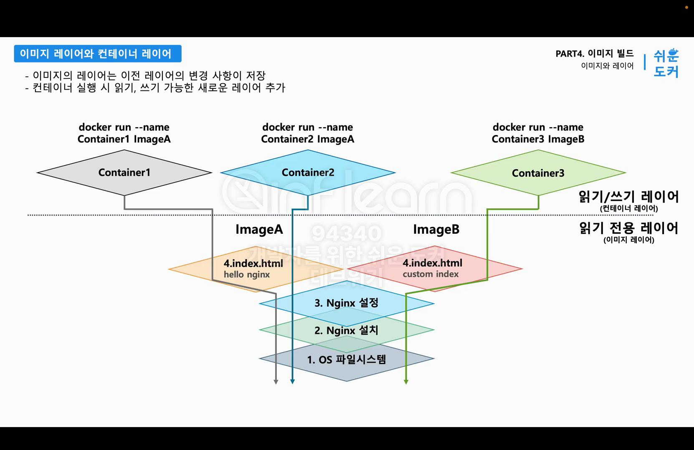

# 이미지 빌드

## 파트 소개

## 이미지와 레이어(Layer)
- 이미지
  - 컨테이너 실행을 위한 읽기 전용 파일
- 도커 이미지
  - 저장소를 효율적인 사용을 위해 레이어드 파일 시스템으로 구성!
    - 레이어는 층을 의미한다.
    - 레이어드 구조
      - 재사용에 유리하다.
      - 공간 효율 사용 가능
      - 이미지 전송 저장시 스토리지와 네트워크 사용량 절약 가능!
  - 각각의 레이어는 이미지의 일부!
- 이미지 레이어
  - 바로 직전 단계 레이어에서 변경된 내용들만 저장된다.
  - nginx 이미지 설계 단계
    - OS
    - Nginx 설치
    - Nginx 설정
    - Index.html 파일 수정
  - Nginx 이미지 레이어
    - 이미지 A
      1. OS 파일 시스템 레이어
      2. Nginx 설치 레이어 (설치 파일)
      3. Nginx 설정 레이어 (설정 파일 - nginx.conf)
      4. index.html 레이어 (index.html 파일)
    - 이미지 B
      - 1, 2, 3이 같고, 4번만 index.html 파일을 custom index로 내용 변경이라고 가정
      - 1 ~ 3은 같은 레이어 재사용, 마지막 레이어만 새롭게 추가되어 이미지 B가 완성!
      - 총 3개의 레이어를 공유하고 하나의 레이어를 별도로 사용하는 구조!
  - 설명
    - OS가 준비되고, OS 위에 Nginx 소프트웨어를 설치한다.
    - 소프트웨어 설치시 OS 특정 폴더에 Nginx 소프트웨어와 관련된 파일들이 추가된다.
    - Nginx 설치한다는 의미는 기존 OS 파일 시스템에서 **추가되는 부분이 생긴다**는 것!
    - 기존 레이어 수정이 아니라, 기존 레이어 위에 변경된 내용들이 새로운 레이어로 저장된다.
    - Nginx 설치 레이어에는 직전 레이어인 OS 레이어에서 Nginx 소프트웨어가 추가된 부분만 따로 가지고 있다.
    - 즉 이전 레이어와 비교해서, 추가되거나 변경된 파일들이 다음 레이어로 저장되는 것이다.
    - 이미지에서 한 번 저장된 레이어는 변경할 수 없다!
      - 변경 사항 존재시 새로운 레이어로 만들어야 한다.
  - 이미지 레이어로 컨테이너 실행!
    - docker run --name container1 ImageA
      - 이미지 가장 마지막 레이어 위에 새로운 읽기/쓰기 전용 레이어 추가! -> 컨테이너 레이어라 부른다.
      - 앱 로그, 컨테이너 실행 중 생기는 변경 사항 -> 새로운 레이어(컨테이너 레이어)에 저장된다.
      - 이미지 레이어는 수정 불가한 읽기 전용 레이어!
      - 이미지 레이어와 컨테이너 레이어는 역할이 완전 다르다!
        - 이미지 레이어 -> 컨테이너 실행을 위한 세이브 포인트
        - 컨테이너 레이어 -> 이미지를 컨테이너로 실행 후 프로세스 변경을 기록하는 레이어
    - docker run --name container2 ImageA
      - 이미지 레이어는 같다! 읽기 전용 레이어 공유
      - 새로운 컨테이너 레이어 하나만 추가된다.
    - 하나의 이미지로 아주 많은 컨테이너를 실행해도, 이미지 레이어는 공유한다!
    
- 명령어
  - docker image history 이미지명
    - 이미지의 레이어 이력 조회
  - docker image inspect 이미지명
    - inspect 출력 결과로 이미지 레이어의 해시 값도 포함되어 있다.
      - RootFs -> Type, Layers
    - 이미지 레이어는 고유 값을 갖고 있다.
- 이미지 레이어는 결과적으로 같은 내용이더라도 구성 순서가 다르면, 완전 다른 레이어로 구성된다.
- 도커 레이어드 파일 시스템
  - Layering
    - 중복 데이터 최소화
    - 빌드 속도 향상
    - 저장소 효율적 사용
  - Copy-on-Write(Cow) 전략
    - 해당 파일의 복사본을 만들어 변경 사항 적용
  - Immutable Layers (불변 레이어)
    - 이미지 일관성 유지
  - 캐싱
    - 빌드된 레이어 재사용
    - 이미지 생성 속도를 크게 절약 가능

## 이미지 커밋(Commit)
- 이미지를 만드는 두 가지 방법
  1. 커밋: 현재 컨테이너 상태를 이미지로 저장
  2. 빌드: Dockerfile을 통해 이미지 저장 (대부분 사용, 그러나 커밋 기반 동작)
- 이미지 커밋
  1. Nginx 이미지를 컨테이너로 실행
  2. index.html 수정
  3. image run -> 컨테이너 레이어(읽기, 쓰기) 생성
     - 이미지 원래 파일을 컨테이너 레이어에 COPY, 수정된 파일 내용을 write
  4. 도커 commit을 통해 컨테이너 레이어, 이미지 레이어 모든 레이어를 이미지로 저장!
- 명령어
  - docker run -it --name 컨테이너명 이미지명 bin/bash
    - 컨테이너 실행과 동시에 터미널 접속
    - -it: 커맨드 창을 통해 실행할 컨테이너와 직접 상호작용 가능
  - docker commit -m 커밋명 실행중인컨테이너명 생성할이미지명
    - 실행 중인 컨테이너를 이미지로 생성
- 예시
  - docker commit -m "edited index.html" -c 'CMD ["nginx", "-g", "daemon off;"]' officialNginx itchoi0429/commitnginx
  - docker run -d -p 80:80 --name my-nginx itchoi0429/commitnginx
  - docker push itchoi0429/commitnginx

## 이미지 빌드(Build)
- IaC와 이미지 빌드
  - IaC(Infrastructure as Code): 인프라 상태를 코드로 관리
    - 휴먼 에러 방지
    - 인프라 상태 및 변경 기록 관리 수월
    - 사람보다 훨씬 빠르다.
- 도커 -> Dockerfile을 통해 원하는 이미지 상태를 코드로 관리 가능
  1. Dockerfile 명세서 작성
  2. docker build 명령을 통해 이미지 생성
     - 임시 컨테이너 생성
     - 변경사항 적용 후 커밋 (새로운 레이어 생성)
     - 임시 컨테이너 삭제
  - 여러 개 레이어 쉽게 추가 가능 -> 도커가 알아서 반복! IaC 방식으로 소스코드 관리 가능
- 가장 많이 사용되고, 핵심!
- 기본 Dockerfile 지시어
  - FROM 이미지명
    - 베이스 이미지 지정
    - 도커가 이미지를 빌드 할 때 처음 시작할 베이스 이미지
    - 필수 표시, 이미지 빌드시 필요한 파일 시스템이 있는 이미지를 베이스 이미지로 지정하는 것이 좋다.
  - COPY 파일경로 복사할경로
    - 원하는 파일을 레이어에 복사
  - CMD ["명령어"]
    - 이미지를 컨테이너로 실행시 명령어 지정
    - 작성 명령어는 메타데이터 CMD 필드에 저장된다.
- Dockerfile 작성
  - git clone https://github.com/daintree-henry/build.git
    - 강의 자료 클론
    - 브랜치
      - 00-init -> 직접 작성
      - 01-dockerfile -> 스킵
- 명령어
  - docker build -t 이미지명 Dockerfile경로
    - 도커 파일을 통해 이미지 빌드
  - docker build -t 레지스트리명/buildnginx .
    - 마지막 .는 Dockerfile이 위치한 경로로 이동했기 때문에 사용 -> build context 지정(.)
    - -t: 빌드할 이미지명 지정
  - docker run -d -p 80:80 --name build-nginx 레지스트리명/buildnginx
- 이미지 생성 방식
  - docker commit -> 사람이 이미지 생성
  - docker build -> 도커 데몬이 Dockerfile 지시어를 읽어 이미지 자동 생성

## 빌드 컨텍스트(Build Context)
- 빌드 컨텍스트
  - 이미지를 빌드 할 때 사용되는 폴더
- 이미지 빌드 방식
  - 도커 데몬에게 Dockerfile과 빌드에 사용될 파일들을 전달 (build context)
    - nginx로 치면, index.html과 Dockerfile을 포함한 폴더
    - COPY 지시어를 통해 build context 파일(custom index.html)이 build에 사용될 컨테이너로 복사  
    - 도커 데몬은 build context 안 파일만 COPY 지시어 사용 가능
    - .dockerignore를 통해 build context로 전달될 파일 관리 가능 -> 이미지 빌드에 필요한 것만 도커 데몬이 인지하도록...
  - 도커 데몬이 임시 컨테이너 실행해 레이어들을 하나씩 추가

## 도커파일(Dockerfile) 지시어
- 도커 빌드와 애플리케이션 빌드는 다르다.
  - 애플리케이션 빌드: 소스코드를 실행 가능한 프로그램으로 빌드
    - source code -> application
      - 관련 라이브러리 다운
      - 실행 가능 상태
      - 애플리케이션, 프로그램, 아티팩트
  - 도커 빌드
    - Dockerfile을 이미지로 빌드
    - Dockerfile -> Image
      - 이미지 빌드 과정에서 소스 코드를 다운 받아, 실행 가능한 아티팩트로 만드는 애플리케이션 빌드과정을 포함할 수 있다.
- 기본 Dockerfile 지시어
  - 파일 시스템 내용 변경 -> 새로운 레이어 추가, 메타데이터만 영향 -> 레이어 추가 X
    - 지시어를 활용해 레이어 개수 조절 가능
  - FROM 이미지명
    - 베이스 이미지 지정
  - COPY 빌드컨텍스트경로 레이어경로
    - 빌드 컨텍스트의 파일을 레이어에 복사 (cp) (새로운 레이어 추가)
  - RUN 명령어
    - 명령어 실행 (새로운 레이어 추가)
  - CMD ["명령어"]
    - 컨테이너 실행 시 명령어 지정
  - WORKDIR 폴더명
    - 작업 디렉토리 지정 (cd) (새로운 레이어 추가)
    - 이후 사용 지시어에 영향을 주기에, 가능한 FROM 다음 작성하는 것이 좋다.
    - 기존 이미지 파일 시스템과 섞이지 않고 별도 폴더로 관리하기에, 초반에 경로를 지정하는 것이 좋다.
  - USER 유저명
    - 명령 실행 사용자 변경 (su) (새로운 레이어 추가)
  - EXPOSE 포트번호
    - 컨테이너가 사용할 포트 명시
  - ARG 변수명 변수값 
    - 이미지 빌드 시점의 환경 변수 설정
    - docker build --build-arg 변수명=변수값 -> 덮어쓰기 가능
    - html에서 환경 변수로 읽어 사용 X
    - 특수한 경우 제외하고 ENV 사용!
  - ENV 변수명 변수값 
    - 이미지 빌드 및 컨테이너 실행 시점의 환경 변수 설정
    - docker run -e 변수명=변수값 -> 덮어쓰기 가능
    - html에서 환경 변수로 읽어 사용 O
  - ENTRYPOINT ["명령어"]
    - 고정된(중복된) 명령어 지정
    - 예시 -> npm install 또는 npm start
    - ENTRYPOINT ["npm"] \n CMD ["start"] -> CMD 명령이 npm start 명령 실행
    - 불편할 수 있지만, 보안적으로 활용 가능
      - ENTRYPOINT ["npm"] 설정시 docker run에 /bin/bash 등의 명령어를 사용해도 터미널로 접근 불가
      - ENTRYPOINT도 덮어쓰기가 가능하기 때문에 100% 보안적이진 않다.
        - 의도하지 않은 동작을 방지하는 것에 의의를 둔다.
- 명령어
  - docker build -f 도커파일명 -t 이미지명 Dockerfile경로
    - -f: 도커파일명이 Dockerfile이 아닌 경우 별도 지정

## 멀티 스테이지 빌드(Multi-Stage Build)
- Dockerfile에서 두 개의 베이스 이미지를 활용하는 방법
- 앱 빌드 과정에서 생성되는 파일은 용량을 많이 차지한다 -> 이 파일은 실제 엡 실행에 사용되진 않는다. -> 이미지 빌드와 실행할 때 이미지를 분리
- 잘 활용하면 실제 앱 실행 이미지 크기를 줄일 수 있다.
- 예시
  - 백엔드 스프링 부트, App 이미지 구성 -> java, maven 사용
  - maven -> 빌드 할 때만 사용, 앱 실행에 필요하지 않다. 그러나 Maven 사이즈가 커서 이미지 사이즈도 커진다.
  - 이미지 레이어
    - OS
    - Java Runtime
    - mvn
    - git clone
    - mvn clean package
    - app.jar 생성
    - java -jar app.jar
    - 브라우저 접근 가능 
```dockerfile
FROM maven:3.6 AS build
# 내용 생략
FROM openjdk:11-jre-slim
# 빌드 컨텍스트 파일이 아니라, build라는 maven 스테이지에서 파일을 가져온다.
# 도커가 지시어를 읽어 임시 컨테이너를 만드는데, FROM 두 개일 경우 두 개의 임시 컨테이너를 생성하고, 임시 컨테이너끼리 파일 공유를 할 수 있다.
COPY --from=build /app/target/*.jar ./app.jar
```
- 메이븐, 자바를 싱글 스테이지, 멀티 스테이지 방식에 따라 예시에서는 이미지 사이즈 3배 차이가 발생
- 단일 스테이지
  - 실행 단계에 불필요한 소스 코드, 라이브러리, 실행파일 등 포함
- 멀티 스테이지
  - 빌드, 실행 이미지 분리