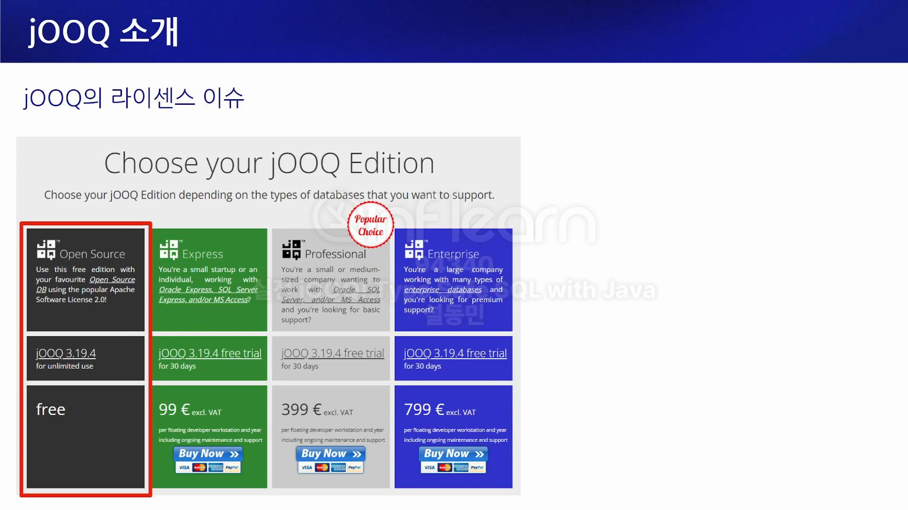

# JOOQ 소개

## 강의 소개
- Java Object Oriented Querying
  - 자바 코드 -> SQL 작성
- 쿼리를 문자열로 작성하여 컴파일 단계에서 체크하지 못해 장애 발생 -> 해소 개념으로 시작
  - 그렇다면 JPA 사용? -> 모든 것을 해결 할 수 없다. 하나만 쓸 필요도 없다.
  - 개발, 빌드, 컴파일 단계에서 사전 방지 가능 -> 안정적 서비스, 휴먼 에러 최소화
- JOOQ 장점
  - 문법 오류 컴파일 단계 체크 체크 가능
  - 스키마 구조를 컴파일 타임 체크 가능
  - 모든 RDBMS 기능들을 TypeSafe하게 사용 가능
  - XML 작업 -> 없음.
- 어떤 쿼리, 어떤 데이터를 조회했는지 콘솔로 확인 가능
- 완전 오픈 소스 아님, 무료 사용 오픈 소스가 있지만, 상업용에 대해 개발자 인당 돈 지불 필요

  - 오픈 소스 버전으로 진행 예정

## MyBatis도 JPA도 아닌 왜 JOOQ 인가?
- MyBatis 한계점
  - 구문 오류 -> 휴먼 에러 발생 가능
  - 동적 문법 -> OGNL(Object-Graph Navigation Language)
    - #{firstName}
  - 객체 안 인스턴스 변수 -> resultMap, association, .. 등으로 작성
- JPA 한계점
  - fetchJoin을 하는지 내부를 들여봐야 한다. 테스트도 애매하다.
  - Hibernate -> SQL의 95% 대체 가능
    - 5%는 대체 불가능 - 크리티컬한 내용
      - bulk insert
      - common table expression (cte)
      - index, optimizer hint
      - db specific function (mysql.groupConcat)
- 결과물이 JPQL이 아닌 SQL이라면 문제 해결? JOOQ 사용!
- JOOQ 장점
  - type safe
  - xml 사용 없음
  - 자동 생성 간단 crud
  - sql 제어권
  - mybatis -> jooq 100% 대체 가능
  - jpa -> jooq 복잡한 쿼리만 대체 고려
    - jpa와 네이티브 쿼리 장점을 같이 가져가는 방법 고려