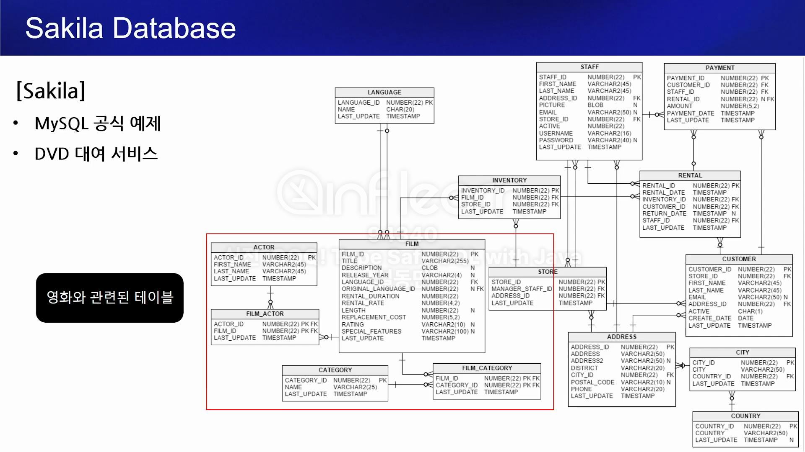

# 프로젝트 환경설정

## Sakila Database 소개
- Sakila DB로 예제 환경 구성하기
  - MySQL 공식 제공하는 예제 스키마
  - DVD 대여 서비스 (OTT X, 비디오 가게 O)

  - docker -> mysql -> Sakila DB 설정
  - h2 DB 사용에도 문제는 없지만, JOOQ는 DB를 직접 읽어 DSL을 만드는 특징이 있다. 직접 mysql DB로 실습!
  - Sakila DB 예제 다운!
    - https://github.com/JOOQ/sakila
      - zip 파일 다운로드
      - 

## (실습) Sakila DB를 기반으로 DB 구성하기

## jOOQ 프로젝트 생성하기

## (실습) jOOQ 프로젝트 생성하기

## 생성된 DSL 구조 살펴보기

## jOOQ DSL Custom 하기
